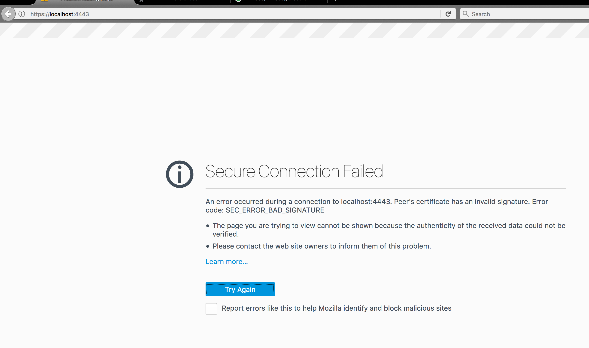
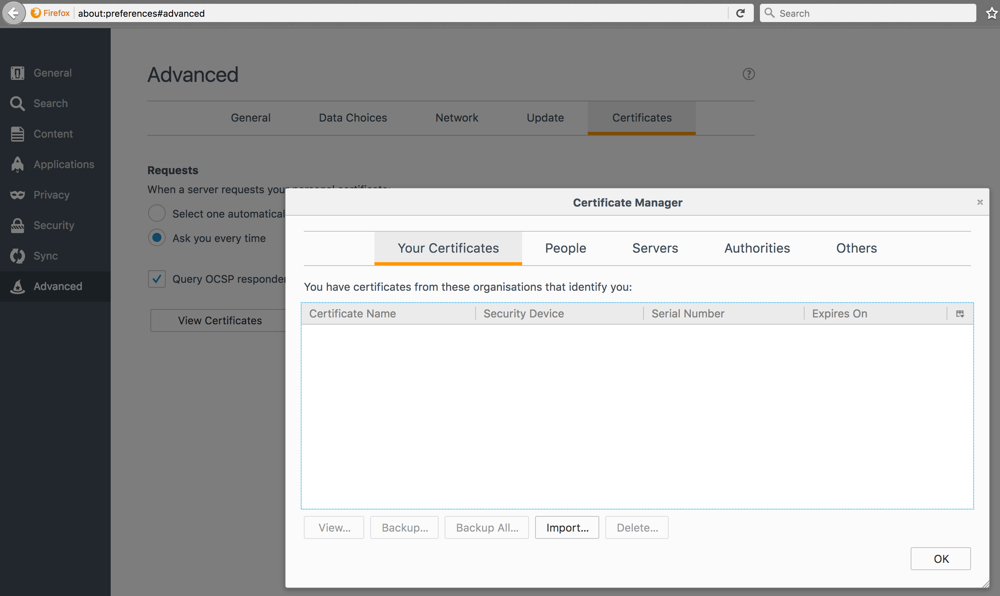
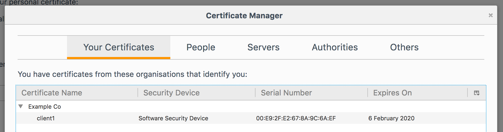
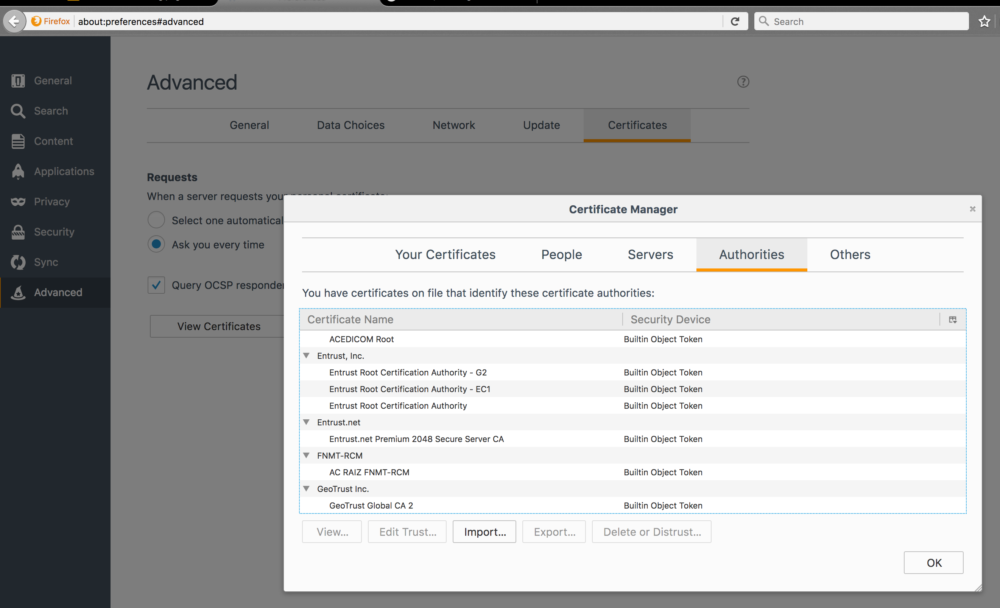
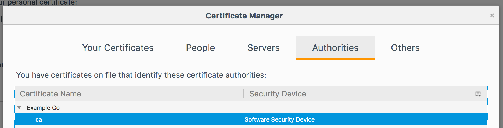
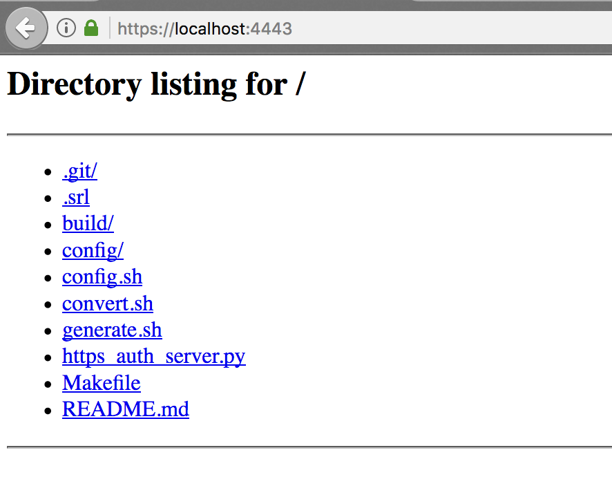
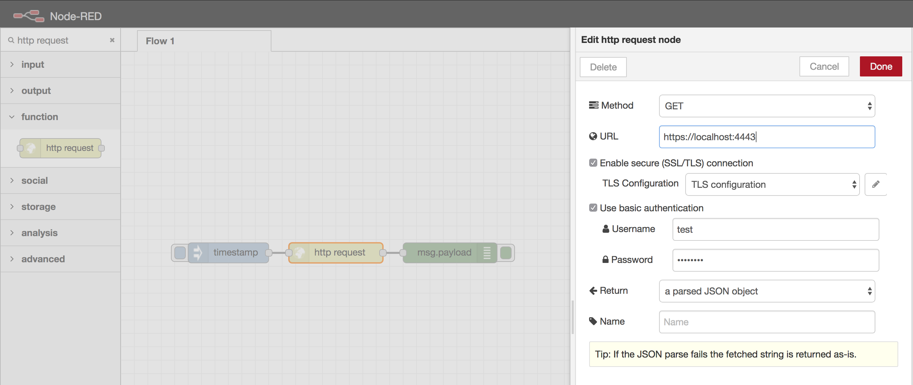
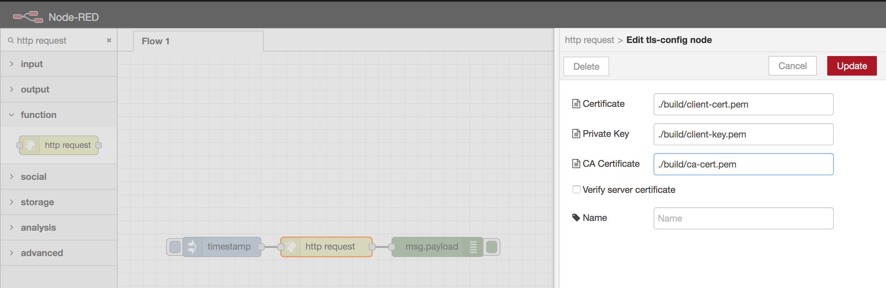

# Test Certificate Generator

> Generates Certificates for CA, Server and Client.
> Includes a convertor for Firefox browser certificates (PK12) and Tomcat (pkcs8)

Originally written to test NodeRed's HTTP *request* node over HTTPS with Basic Auth.

# Disclaimer

**Use at your own risk**

Included in ```./build``` are pre-built certificates for testing purposes, obviously don't use these the wild as these keys are now compromised being on GitHub.

You're also comprising your browser by leaving these pre-built keys installed.


# Build certificates

```sh
make
```

# Run test server

Included is a basic python https server that uses the generated certificates.

```sh
python https_auth_server.py
```

Default settings

```sh
python https_auth_server.py localhost 4443 test:test ./build/server-key.pem ./build/server-cert.pem
```

# Install Client and CA Certificate in Firefox

Navigate to [https://localhost:4443](), you will be presented with a ```SEC_ERROR_BAD_SIGNATURE``` error.



Now we need to install the PK12 client certificate we generated.

1. Navigate to the Certificates settings in Firefox
	a. Goto the URL ```about:preferences#advanced``` then the ```Certificates```
	b. or head to  ```Preferences > Advanced > Certificates ```
2. hit the ```View Certificates``` button
3. Under ```Your Certificates``` hit ```Import...```



4. Find your ```./build/client-cert.p12``` file and install
5. When prompted for a **password** type ```password```



5. Install the CA certificate, click the ```Authorities``` Tab



6. Hit the ```Import...``` button
7. Find your ```./build/ca-cert.pem``` file and install

8. Hit ```Ok``` and your done.
9. Refresh or navigate to [https://localhost:4443/]()
10. Basic Auth password is ```test``` / ```test``` for username and password respectively.


# Install Client and CA Certificate in NodeRed

1. Goto your ```http request``` node


|-|-|
|Setting|Value|
|-|-|
|Method| Get |
|URL| https://localhost:4443 |
|Enable SSL/TLS| On |
|Use Basic Auth| On |
|Username| Test |
|Password| Test |

2. Hit the edit ```TLS Configuration``` 🖋 button


|-|-|
|Setting|Value|
|-|-|
|certificate| [path to ```client-cert.pem```] |
|private key| [path to ```client-key.pem```] |
|CA Cert| [path to ```ca-cert.pem```] |
|Verify Server Cert|  Off |


# References

- [http://www.tomcatexpert.com/knowledge-base/using-openssl-configure-ssl-certificates-tomcat]()
- [https://engineering.circle.com/https-authorized-certs-with-node-js-315e548354a2]()
